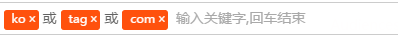

##ko-tag

###简介

knockout的tag组件，回车完成tag键入

###组件截图

#### demo截图

###说明

####引用

<ko-tag params="separator:'or',placeholder:'placeholder',value:aTag,bAllowDuplicate:'true',wrapclass:'tag-com'"></ko-tag>

####参数

-separator:  tag直接的分隔符
-placeholder: 组件中的提示文字
-value : 外部传入的tag数组，必须为observableArray,否则外部无法获取value值
-bAllowDuplicate: 是否允许tag重复，默认false，不允许重复，会有红色提示
-wrapclass: 组件外部包裹的css class，可自定义组件的样式

###编译

运行命令 fis3 release -d ./output 生成合成文件

###bug

1. backspace删除需要按两次才能删除tag
2. 外部传入空tag数组，tag不会清空

###License

[MIT](http://opensource.org/licenses/MIT)
Copyright (c) 2013-2016 ygtzz
